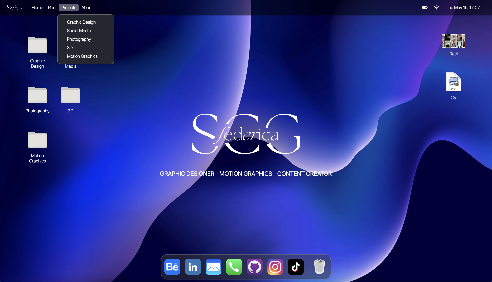
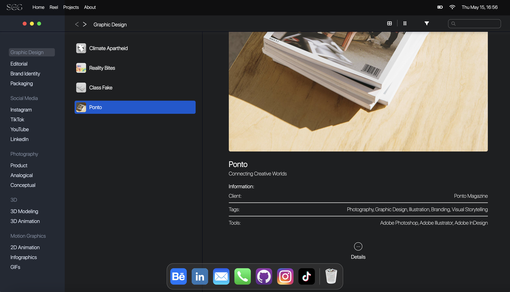
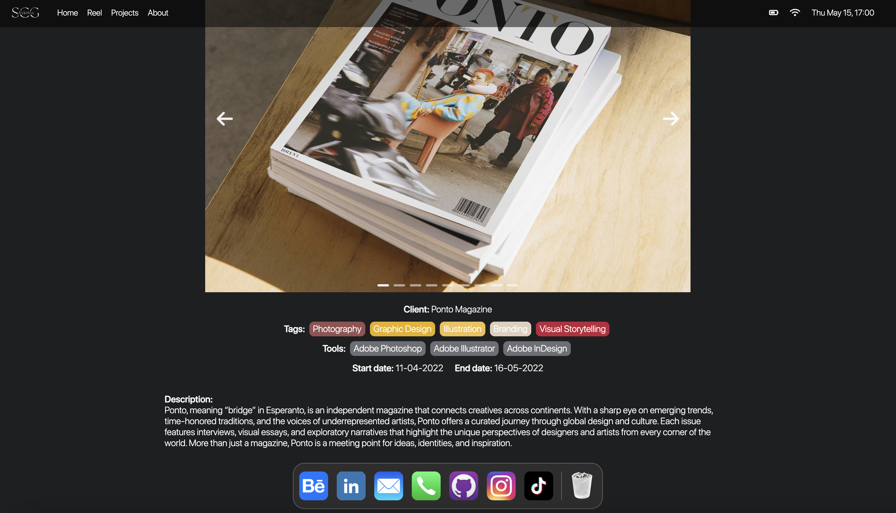
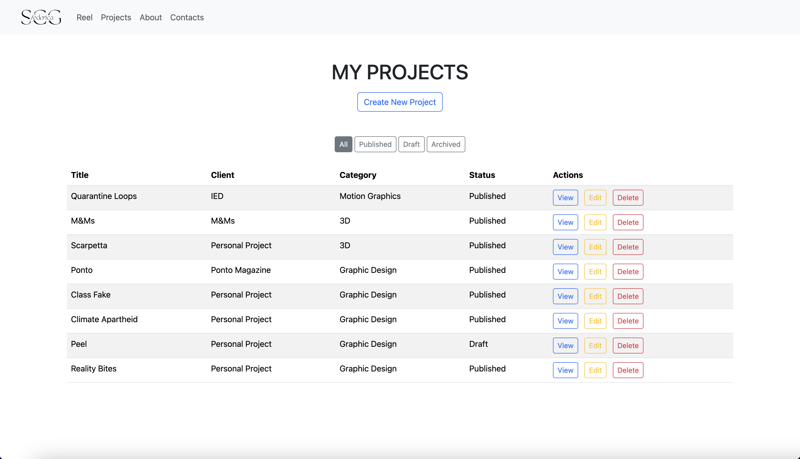
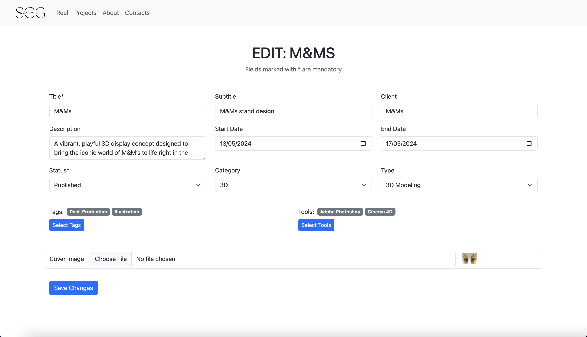
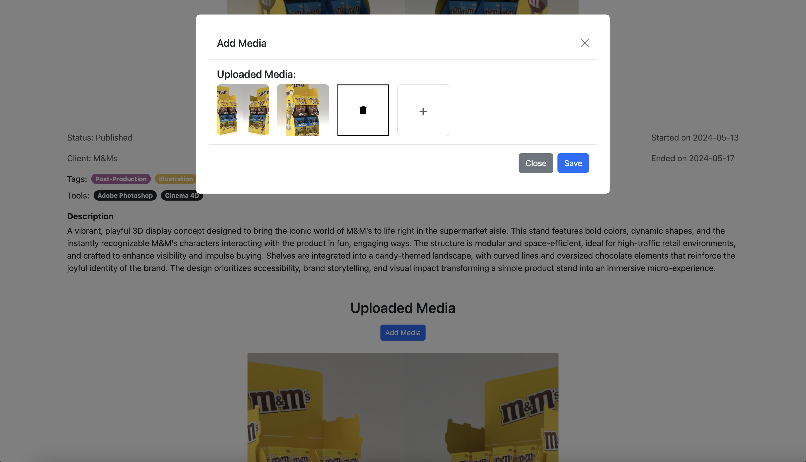

# PERSONAL PORTFOLIO WEBAPP 


Questo progetto è il risultato finale della specializzazione in PHP e Laravel. Si tratta di un portfolio personale full stack sviluppato per mettere in pratica e consolidare le competenze acquisite durante il corso, combinando un backend robusto e funzionale con un frontend creativo e interattivo.

--- 

## Indice

- [Descrizione](#descrizione)
- [Caratteristiche](#caratteristiche)
  - [Backend (Laravel/PHP)](#backend-laravelphp)
  - [Frontend (React/JavaScript)](#frontend-reactjavascript)
- [Tecnologie utilizzate](#tecnologie-utilizzate)
- [Installazione](#installazione)
- [Configurazione](#configurazione)
- [Uso](#uso)
- [Screenshots](#screenshots)
- [Struttura del progetto](#struttura-del-progetto)
- [Contributi](#contributi)

---

## Descrizione

Questo progetto rappresenta il lavoro finale della mia specializzazione in PHP e Laravel. Ho scelto di sviluppare un portfolio personale full stack per mettere in pratica e consolidare le competenze acquisite durante il corso, combinando funzionalità backend robuste con un’interfaccia front-end creativa, ispirata al sistema operativo macOS.

Il progetto comprende un app back-office per la gestione dei contenuti. E una client app per la visualizzazione di questi ultimi. 

---

## Caratteristiche

### Backend (Laravel/PHP)
- Autenticazione utenti con gestione sicura delle sessioni
- CRUD completo per la gestione dinamica dei contenuti (categorie, progetti, media)
- Struttura dati relazionale efficiente con MySQL e gestione tramite Eloquent ORM
- API REST per comunicazione fluida con il frontend React
- Interfaccia back-office sviluppata con Bootstrap, per una gestione contenuti semplice, responsive e accessibile

### Frontend (React/JavaScript)
- Interfaccia ispirata a macOS, con design pulito e intuitivo
- Gestione dinamica dei contenuti tramite fetch alle API Laravel
- Routing dinamico tra sezioni con React Router
- Stato globale gestito con React Context API per sincronizzazione efficiente dei dati
- Stilizzazione personalizzata tramite CSS puro per controllo completo sull’estetica e l’esperienza utente

---

## Tecnologie utilizzate

- **Backend:** PHP, Laravel, JavaScript, MySQL, Eloquent ORM, Bootstrap
- **Frontend:** React, JavaScript, React Router, React Context API, CSS puro
- **Strumenti:** Composer, npm, Git

---

## Installazione

### Backend

1. Clona il repository:
   ```bash
   git clone https://github.com/federicascognamiglio/portfolio-complete.git
   cd portfolio-complete/backend
    ```

2. Installa le dipendenze PHP:
    ```bash
    composer install
    ```

3. Configura il file .env con i tuoi dati database:
    ```ini
    DB_CONNECTION=mysql
    DB_HOST=127.0.0.1
    DB_PORT=3306
    DB_DATABASE=nome_database
    DB_USERNAME=tuo_username
    DB_PASSWORD=tua_password
    ```
4. Esegui migrazioni e seeders:
    ```bash
    php artisan migrate --seed
    ```

5. Avvia il server Laravel:
    ```bash
    php artisan serve
    ```

### Frontend

1. Spostati nella cartella frontend:
    ```bash
    cd ../frontend
    ```

2. Installa le dipendenze npm:
    ```bash
    npm install
    ```

3. Avvia il progetto React:
    ```bash
    npm start
    ```

## Configurazione
- Assicurati che il backend Laravel sia avviato e accessibile (default http://localhost:8000)

- Il frontend React effettua chiamate alle API del backend per ottenere i dati

- Se necessario, modifica il file di configurazione API nel frontend (es. src/config.js)

## USO 
- Accedi al back-office tramite /admin per gestire contenuti, categorie e media

- Usa l’interfaccia frontend per visualizzare il portfolio dinamicamente, navigando tra le sezioni e i progetti

- L’autenticazione protegge le aree di gestione contenuti

## SCREENSHOTS

### CLIENT
- HOME PAGE



- FINDER



- DETAIL PAGE




### BACK-OFFICE
- DASHBOARD



- EDIT PAGE 



- MEDIA MODAL




## STRUTTURA DEL PROGETTO

```bash
portfolio-complete/
│
├── backend/               # Codice Laravel (PHP)
│   ├── app/
│   ├── database/
│   ├── resources/views/
│   └── routes/
│
├── frontend/              # Codice React (JavaScript)
│   ├── public/
│   ├── src/
│       ├── components/
│       ├── context/
│       ├── pages/
│       ├── styles/
│       └── App.js
│
└── README.md
```

## Contributi

Il progetto è stato sviluppato interamente da Federica Scognamiglio come lavoro finale. Per suggerimenti o miglioramenti, apri una issue o una pull request.